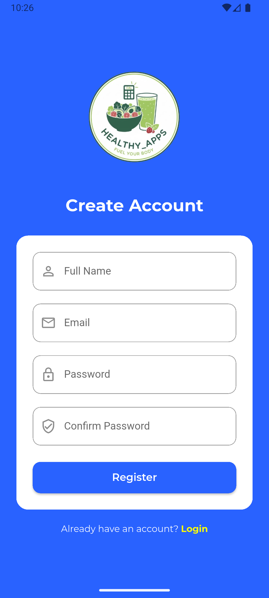
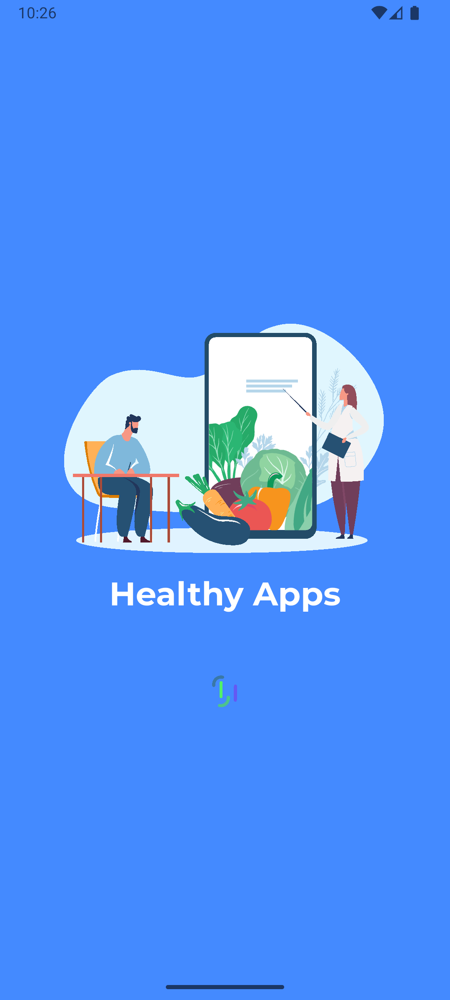
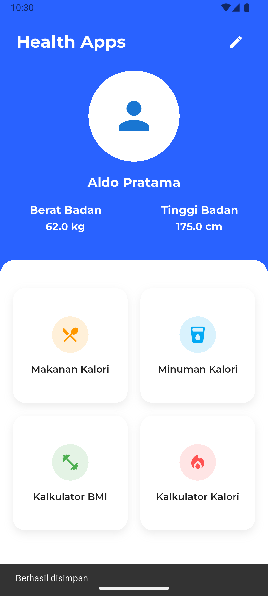
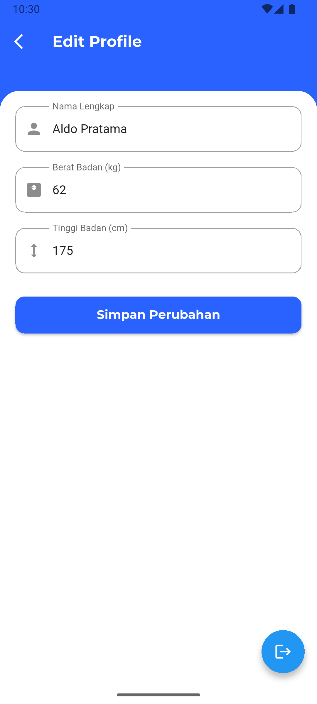
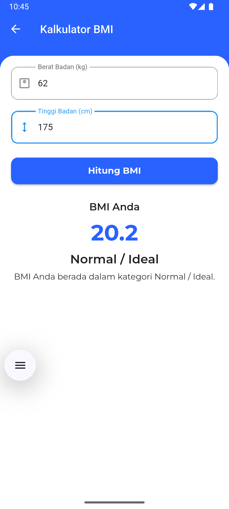
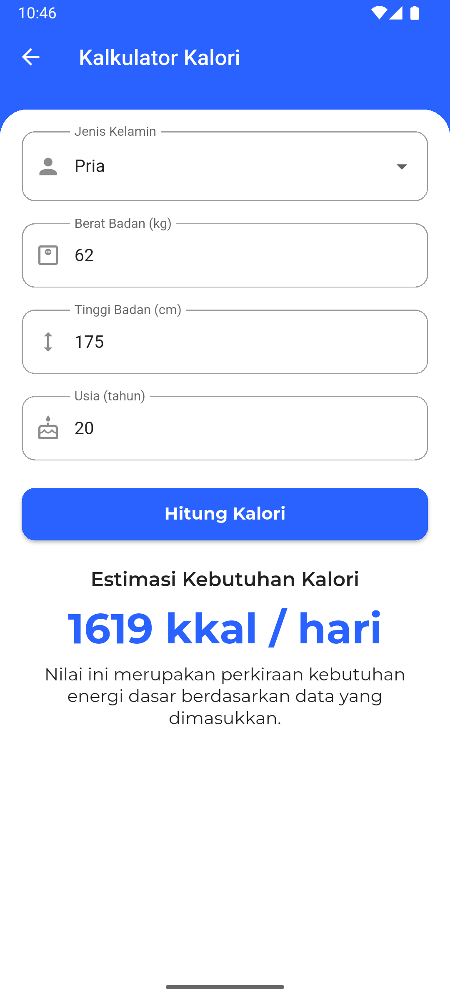
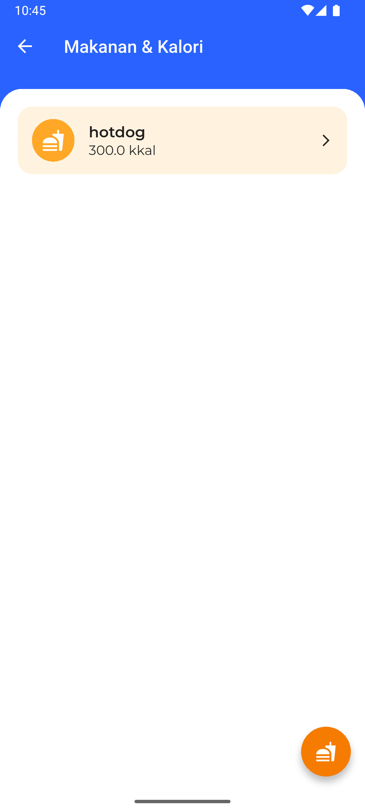
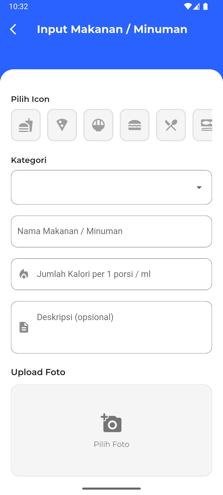

 # 🏥 Sehat Apps 

| Flutter | Supabase |
|---------|----------|
| [](https://flutter.dev) | [](https://supabase.com) |


Sehat Apps adalah aplikasi kesehatan yang membantu pengguna memahami kondisi tubuh dan kebutuhan nutrisi harian dengan lebih mudah dan akurat. Aplikasi ini dilengkapi fitur perhitungan BMI (Body Mass Index) untuk mengetahui kategori berat badan, serta fitur perhitungan kalori harian berdasarkan aktivitas dan kebutuhan tubuh pengguna. Selain itu, Sehat Apps menyediakan informasi mengenai kalori pada makanan dan minuman, sehingga pengguna dapat memantau asupan harian dengan lebih terarah. Setiap data yang dicatat akan disajikan secara sederhana dan informatif, membantu pengguna menjaga pola hidup sehat dan mengatur gaya hidup secara lebih efektif.

## 📸 Screenshots

| Login | Register |
|-------|-------|
|  |  |

| splash | HOME |
|--------|--------------|
|  |  |

| PROFILE | BMI
|---------|------|
|  |  |

| KALORI | INFO MAKANAN DAN MINUMAN
|---------|------|
|  |  |

| INPUT INFO |
|---------|
|  | 


## 🛠 Cara Menjalankan Project

### **1. Clone Repository**
```
git clone <repo-url>
```


### **2. Setup Flutter**
```
cd <repo>
flutter pub get
flutter run
```
> ⚠️ **Noted**  
> Pastikan Anda telah menginstall **Node.js** dan melakukan **Supabase setup** agar file konfigurasi yang diperlukan dapat dibuat melalui perintah inisialisasi Supabase.


---

## 📱 Fitur Aplikasi

- **Perhitungan BMI (Body Mass Index)**  
  Mengetahui kategori berat badan seperti kurus, normal, overweight, dan obesitas.

- **Perhitungan Kalori Harian**  
  Menghitung kebutuhan kalori berdasarkan usia, berat badan, tinggi badan, dan aktivitas harian.

- **Informasi Kalori Makanan & Minuman**  
  Menyediakan daftar makanan/minuman beserta jumlah kalorinya untuk membantu pengguna memantau asupan nutrisi.

- **Pencatatan Asupan Harian**  
  Pengguna dapat mencatat makanan dan minuman yang dikonsumsi setiap hari.

- **Riwayat & Tracking Harian**  
  Melihat perkembangan pola makan dan perubahan data kesehatan dari waktu ke waktu.

- **Tampilan Sederhana & Mudah Dipahami**  
  Antarmuka yang ringan untuk membantu pengguna mengakses fitur kesehatan dengan cepat.


 
